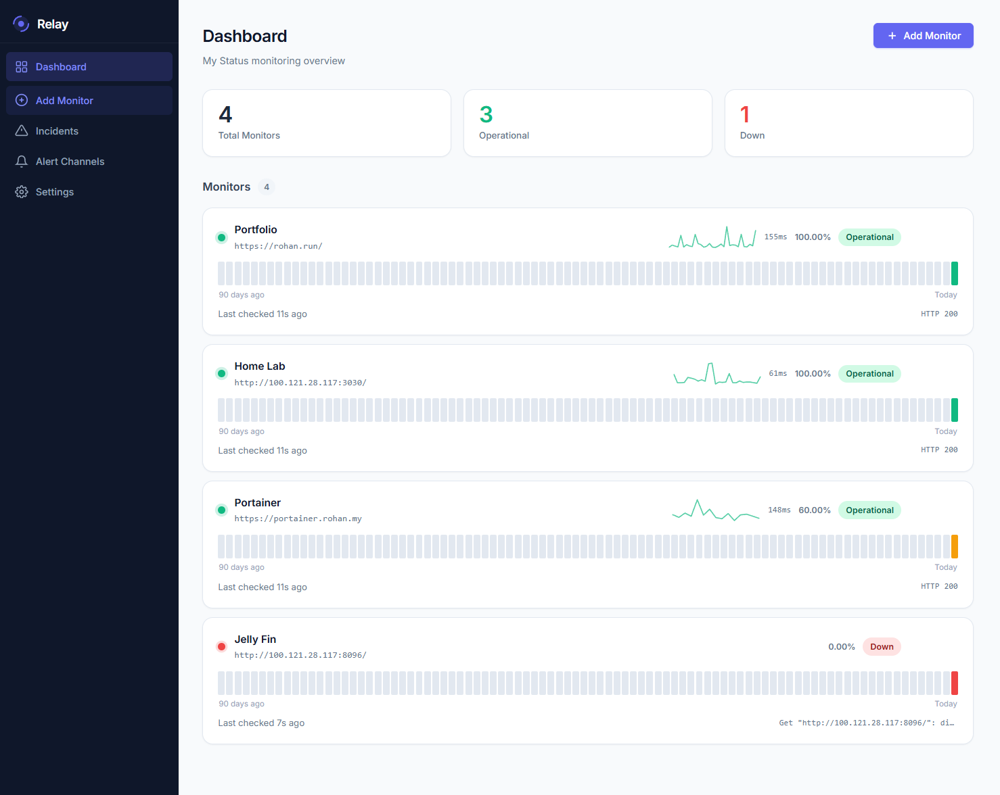
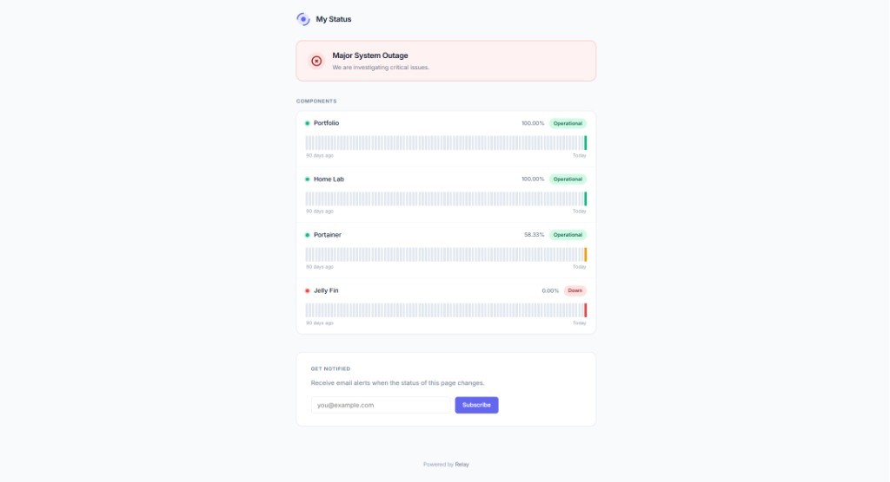

<p align="center">
  
</p>

<h1 align="center">Relay</h1>

<p align="center">Self-hosted, enterprise-grade uptime monitoring <strong>with a built-in public status page</strong> — one tool, zero duct tape.</p>


Relay alerts you **and your users** when something breaks — through a beautiful public status page with incident management, team RBAC, REST API, PagerDuty/OpsGenie alerts, maintenance windows, and an audit log. All in a single ~15 MB Go binary with a SQLite database.

```bash
docker run -d -p 8080:8080 -v relay-data:/data \
  -e RELAY_SECRET=$(openssl rand -hex 16) \
  -e RELAY_ADMIN_PASS=yourpassword \
  ghcr.io/rohzzn/relay
```

---

## Screenshots

<table>
  <tr>
    <td width="50%" align="center">
      
      <br><br>
      <strong>Admin Dashboard</strong><br>
      Real-time monitor overview with sparklines, grouped monitors, 90-day uptime bars, dark mode, and live WebSocket updates.
    </td>
    <td width="50%" align="center">
      
      <br><br>
      <strong>Public Status Page</strong><br>
      Grouped components, incident banners, 90-day uptime bars, incident history, and email subscriptions.
    </td>
  </tr>
</table>

---

## Why Relay?

Self-hosters need two separate tools to do what Relay does in one — and neither tool has enterprise features unless you pay:

|                       | Uptime Kuma     | Statuspage.io   | **Relay**       |
|-----------------------|:---------------:|:---------------:|:---------------:|
| Self-hosted           | ✓               | ✗               | ✓               |
| Public status page    | ✗               | ✓               | ✓               |
| Grouped components    | ✗               | ✓               | ✓               |
| Email subscribers     | ✗               | ✓ (paid)        | ✓               |
| Incident management   | ✗               | ✓               | ✓               |
| REST API              | ✗               | ✓ (paid)        | ✓               |
| Team RBAC             | ✗               | ✓ (paid)        | ✓               |
| PagerDuty / OpsGenie  | ✗               | ✓ (paid)        | ✓               |
| Maintenance windows   | ✗               | ✓               | ✓               |
| Audit log             | ✗               | ✓ (paid)        | ✓               |
| Slack / webhook       | ✓               | ✓ (paid)        | ✓               |
| Docker image size     | ~200 MB (Node)  | —               | **< 20 MB**     |
| Free                  | ✓               | ✗               | ✓               |

---

## Features

### Core monitoring
- **HTTP, TCP, TLS, DNS, and Heartbeat monitors** — check APIs, ports, certificate expiry, DNS resolution, and cron jobs
- **Live admin dashboard** — real-time status updates via WebSocket, no page reload needed
- **90-day uptime bars** — visual history per monitor, identical to Statuspage.io
- **Sparkline latency graphs** — per-monitor response time trend on every card
- **Pause / resume monitors** — stop checks instantly without deleting the monitor
- **Test Now button** — fire a single probe from the edit form and see the result inline

### Status page
- **Public status page** — fast, works without JavaScript, bookmark-worthy
- **Grouped components** — organise monitors into named sections (API, Database, CDN…)
- **Incident history page** — full paginated archive of past incidents at `/history`
- **Email subscribers** — double opt-in, one-click unsubscribe
- **Custom footer text** — white-label the status page with `RELAY_FOOTER_TEXT`

### Alerting
- **Alert channels** — Slack, generic webhook, SMTP email, **PagerDuty**, **OpsGenie**
- **Per-monitor channel routing** — assign specific channels to each monitor
- **10-minute cooldown** — prevents alert storms; recovery always sends immediately
- **Send Test button** — verify each channel from the UI before going live

### Enterprise
- **Team RBAC** — Admin, Editor, and Viewer roles; bcrypt-hashed passwords
- **REST API** — full CRUD for monitors and incidents at `/api/v1/`; scoped API keys via `Authorization: Bearer <key>`
- **Maintenance windows** — suppress alerts during scheduled downtime, scoped globally or per-monitor
- **Audit log** — paginated record of every admin action: who, what, when
- **Dark mode** — full dark mode toggle with `localStorage` persistence; respects `prefers-color-scheme`

### Infrastructure
- **Single Go binary** — no Node, no Python, no runtime dependencies
- **SQLite WAL mode** — zero ops, back up with `cp`
- **Distroless Docker image** — under 20 MB, no shell in production
- **Graceful shutdown** — in-flight requests drain cleanly on SIGTERM

---

## Quick Start

### One-liner (no config file)

```bash
docker run -d \
  --name relay \
  --restart unless-stopped \
  -p 8080:8080 \
  -v relay-data:/data \
  -e RELAY_SECRET=$(openssl rand -hex 16) \
  -e RELAY_SITE_NAME="Acme Status" \
  -e RELAY_SITE_URL="https://status.example.com" \
  -e RELAY_ADMIN_PASS=yourpassword \
  ghcr.io/rohzzn/relay
```

- **Status page:** `http://localhost:8080`
- **Admin dashboard:** `http://localhost:8080/admin` (login: `admin` / your password)
- **REST API:** `http://localhost:8080/api/v1/monitors`

### Docker Compose + Caddy (auto-TLS, recommended)

```bash
git clone https://github.com/rohzzn/relay
cd relay
cp .env.example .env
# Edit .env — set RELAY_SECRET, RELAY_ADMIN_PASS, RELAY_SITE_NAME, RELAY_SITE_URL
# Edit Caddyfile — replace status.example.com with your domain

docker compose up -d
```

Caddy handles Let's Encrypt automatically. No certificate configuration needed.

### Build from source

```bash
git clone https://github.com/rohzzn/relay
cd relay
go build -o relay ./cmd/relay

RELAY_SECRET=secret RELAY_ADMIN_PASS=admin ./relay
```

Requires Go 1.22+. No other dependencies.

---

## Configuration

All settings are environment variables. Only `RELAY_SECRET` and `RELAY_ADMIN_PASS` are required:

| Variable | Required | Default | Description |
|---|:---:|---|---|
| `RELAY_SECRET` | **Yes** | — | HMAC key for session cookies. Generate with `openssl rand -hex 16` |
| `RELAY_ADMIN_PASS` | **Yes** | — | Admin dashboard password |
| `RELAY_ADMIN_USER` | | `admin` | Admin username |
| `RELAY_SITE_NAME` | | `Status` | Displayed on the public status page |
| `RELAY_SITE_URL` | | `http://localhost:8080` | Full public URL (used in email links and heartbeat URLs) |
| `RELAY_LOGO_URL` | | — | Logo image URL shown on the status page header |
| `RELAY_FOOTER_TEXT` | | `Powered by Relay` | Custom footer text for white-labelling |
| `RELAY_SMTP_HOST` | | — | SMTP server hostname |
| `RELAY_SMTP_PORT` | | `587` | SMTP port |
| `RELAY_SMTP_USER` | | — | SMTP username |
| `RELAY_SMTP_PASS` | | — | SMTP password |
| `RELAY_SMTP_FROM` | | — | From address for outgoing emails |
| `RELAY_DATA` | | `./data` | Directory for `relay.db` |
| `RELAY_PORT` | | `8080` | HTTP listen port |
| `RELAY_CHECK_CONCURRENCY` | | `20` | Max concurrent check goroutines |
| `RELAY_RETENTION_DAYS` | | `90` | Days of check history to keep |

> **No SMTP?** Subscriber confirmations are auto-approved, so email subscriptions work during local testing without an SMTP server.

---

## Monitor Types

| Type | Target | Example |
|---|---|---|
| **http** | URL | `https://api.example.com/health` |
| **tcp** | `host:port` | `db.internal:5432` |
| **tls** | hostname | `api.example.com` |
| **dns** | hostname | `example.com` |
| **heartbeat** | *(auto)* | cron jobs POST to Relay |

### Per-monitor options

| Option | Applies to | Description |
|---|---|---|
| `timeout_s` | http, tcp, tls, dns | Request timeout in seconds (default 30) |
| `expected_status` | http | Require a specific HTTP status code |
| `keyword` | http | Response body must contain this string |
| `max_latency_ms` | http | Mark degraded if response exceeds this threshold |
| `warn_days` | tls | Mark degraded when cert expires in ≤ N days (default 14) |
| `expected_ip` | dns | Alert if resolved IP doesn't match |

### Heartbeat monitors

A heartbeat monitor expects your cron job to POST to Relay on each run. If the ping stops, Relay opens an incident.

After creating a heartbeat monitor, the dashboard shows the exact endpoint:

```
POST https://status.example.com/ping/{monitor-id}
```

Example crontab entry:
```cron
*/5 * * * * /path/to/job && curl -sS -X POST https://status.example.com/ping/YOUR_MONITOR_ID
```

---

## Alert Channels

Configure channels in **Admin → Alert Channels**:

| Type | Config | Notes |
|---|---|---|
| **Webhook** | URL | Relay POSTs JSON on down/up events |
| **Slack** | Incoming webhook URL | Formatted attachment with status fields |
| **Email** | SMTP credentials + recipient | Uses the channel's own SMTP, not `RELAY_SMTP_*` |
| **PagerDuty** | Integration key | Events API v2 — triggers open, resolves close |
| **OpsGenie** | API key + region | US and EU regions supported |

Use the **Send Test** button on each channel to fire a test alert before relying on it.

### Per-monitor routing

By default, all channels fire for all monitors. On the monitor edit form, check specific channels to route only those — useful for sending database alerts to PagerDuty and API alerts to Slack independently.

Alerts have a built-in **10-minute cooldown** per monitor to prevent alert storms. Recovery ("back up") notifications always send immediately.

---

## REST API

Base URL: `/api/v1/`

Authenticate with `Authorization: Bearer <key>` (create keys in **Admin → Settings**) or a valid admin session cookie.

| Method | Path | Description |
|---|---|---|
| `GET` | `/api/v1/status` | Overall status and active incident count |
| `GET` | `/api/v1/monitors` | List all monitors with uptime percentages |
| `POST` | `/api/v1/monitors` | Create a monitor |
| `GET` | `/api/v1/monitors/:id` | Get a single monitor |
| `PUT` | `/api/v1/monitors/:id` | Update a monitor |
| `DELETE` | `/api/v1/monitors/:id` | Delete a monitor |
| `GET` | `/api/v1/monitors/:id/metrics` | Time-bucketed latency data (`?hours=24`) |
| `GET` | `/api/v1/incidents` | List incidents (`?active=true` for open only) |
| `POST` | `/api/v1/incidents` | Create an incident |

Example:
```bash
curl -H "Authorization: Bearer relay_..." \
     https://status.example.com/api/v1/monitors
```

---

## Team Management

Create team members in **Admin → Team**:

| Role | Permissions |
|---|---|
| **Admin** | Full access — all settings, users, API keys |
| **Editor** | Manage monitors, post incident updates, create maintenance windows |
| **Viewer** | Read-only dashboard access |

The root admin account (`RELAY_ADMIN_USER` / `RELAY_ADMIN_PASS`) always has full access regardless of the team list. Team member passwords are bcrypt-hashed.

---

## Maintenance Windows

Schedule windows in **Admin → Maintenance** to suppress alerts during planned downtime:

- During a window, monitors continue to run and results are recorded — but no incidents are auto-created and no alert channels fire
- Windows can target **all monitors** or a **specific monitor**
- Completed and active windows are listed with their time range

---

## Architecture

```
relay/
├── cmd/relay/          Entry point, graceful shutdown, healthcheck subcommand
├── internal/
│   ├── config/         Environment-based configuration
│   ├── db/             SQLite (WAL mode), all queries — no ORM
│   ├── check/          HTTP · TCP · TLS · DNS · Heartbeat checkers
│   ├── scheduler/      Per-monitor goroutines with semaphore concurrency pool
│   ├── state/          FSM: up/degraded/down, auto incident open/close
│   ├── alert/          Cooldown-aware dispatcher with per-monitor channel routing
│   ├── notify/         Slack · SMTP · Webhook · PagerDuty · OpsGenie adapters
│   └── server/         HTTP handlers · WebSocket hub · HMAC session auth · REST API
└── web/
    ├── templates/       html/template pages — embedded in the binary
    └── static/          CSS (dark mode) + JS — embedded in the binary
```

**Why Go?** Single static binary, goroutine-per-monitor scheduler, ~15 MB Docker image. Uptime Kuma is 200 MB and people notice.

**Why SQLite WAL?** Zero ops. Back up with `cp relay.db relay.db.bak`. Handles dozens of concurrent readers. No Postgres to run.

**Why HTMX?** The live dashboard has real-time updates with zero client-side framework. No React, no build step, loads in <300ms on a Raspberry Pi.

---

## Roadmap

- [x] HTTP, TCP, TLS, DNS, Heartbeat monitors
- [x] Live dashboard via WebSocket
- [x] 90-day uptime bars + sparklines
- [x] Grouped monitor sections
- [x] Incident management with timeline updates
- [x] Email subscriber list with confirmation
- [x] Slack, webhook, SMTP, PagerDuty, and OpsGenie alert channels
- [x] Per-monitor alert channel routing
- [x] Maintenance windows
- [x] Team RBAC (Admin / Editor / Viewer)
- [x] REST API v1 with scoped API keys
- [x] Audit log
- [x] Dark mode
- [x] Pause / resume monitors
- [x] Test Now button
- [x] Public incident history page
- [x] Custom 404/500 pages
- [x] Docker healthcheck subcommand
- [ ] **v2:** `relay-probe` — lightweight agent binary for multi-region monitoring
- [ ] **v2:** Response time history graphs in the dashboard
- [ ] **v3:** On-call schedule with rotating recipients
- [ ] **v3:** SSO (OIDC)

---

## Contributing

1. Fork the repo
2. `go run ./cmd/relay` — starts with live template reloading
3. Templates are in `web/templates/`, styles in `web/static/style.css`
4. Open a PR — all contributions welcome

**Code style:** Standard `gofmt`. No ORM — queries live in `internal/db/db.go` as plain SQL. No external router — Go 1.22 stdlib mux only.

---

## License

MIT — see [LICENSE](LICENSE)

---

*Relay is not affiliated with Uptime Kuma or Statuspage.io.*
